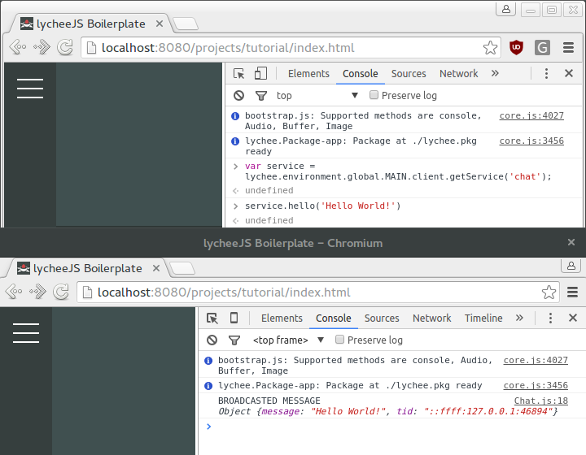

# Create an App Client

This tutorial will explain you how to create an App Client
that uses the `html` platform stack with the
`lychee.net.Client` that you can use client-side.


## Prerequisites

You should have successfully installed lycheeJS already.
If you haven't installed lycheeJS on your development machine,
you can follow the instructions at the [Bundles](#!bundles)
section on the left.

If you didn't do the previous Tutorial, you have to go back
to the [App-Server](#!tutorials/app-server) Tutorial and
download the zip file from there.


## Modify the Project

The isomorphic Boilerplate has already an integrated `lychee.net.Client`,
which you can easily extend with your own `lychee.net.Service`.

Similar to the Server the `HEADER` section of the `source/net/Client.js`
also requires the client-side Services. As you might have noticed
already, the `app.net.client.Ping` Service is the counterpart to the
`app.net.remote.Ping` server-side Service.

As mentioned before, the `lychee.net.Remote` and `lychee.net.Client` share
the same interface ( `lychee.net.Tunnel` ), so they offer identical APIs.


## Create a new Service

You need to create the counter-part to the server-side already working
Chat Service.

For now, you simply create a Service that inherits from the
`lychee.net.client.Chat` interface.

Create the `source/net/client/Chat.js` file with the following content:

```javascript
lychee.define('app.net.client.Chat').includes([
	'lychee.net.client.Chat'
]).exports(function(lychee, app, global, attachments) {

	/*
	 * IMPLEMENTATION
	 */

	var Class = function(client) {

		lychee.net.client.Chat.call(this, 'chat', client, {
			room: 'hello-world',
			user: '@awesome'
		});

		this.bind('broadcast', function(data) {
			console.log('BROADCASTED MESSAGE', data);
		}, this);

	};


	Class.prototype = {

		/*
		 * CUSTOM API
		 */

		hello: function(message) {

			message = typeof message === 'string' ? message : null;

			if (message !== null) {

				this.broadcast({
					message: message
				});

			}

		}

	};

	return Class;

});
```

After you've created the new service with the identifier `chat`, you need
to integrate it with the `app.net.Client`. Add it to the requirements in
the `source/net/Client.js` file.

Don't forget to integrate the Chat-service in the `source/net/Client.js`.
It too is added via `this.addService(new app.net.client.Chat(this))` inside
the `connect event` of the client.

The important part here is that we `broadcast()` the message in the current
peer network. That means the `server-side` part does automatically all the
necessary handshakes, maps them accordingly to the current network peers and
acts as a so-called `Turtle Router` if the other peers are hidden behind a
Firewall or NAT.


If we open up our project now in the Browser (given the `lycheejs-harvester`
is running) on the URL `http://localhost:8080/projects/tutorial/index.html`
we can now try out our small `message()` method.

Open up the console and enter the following command to send a message to
all other active peers (try more than one Browser in parallel!):


```javascript
var service = lychee.environment.global.MAIN.client.getService('chat');

service.hello('Hello World!');
```



