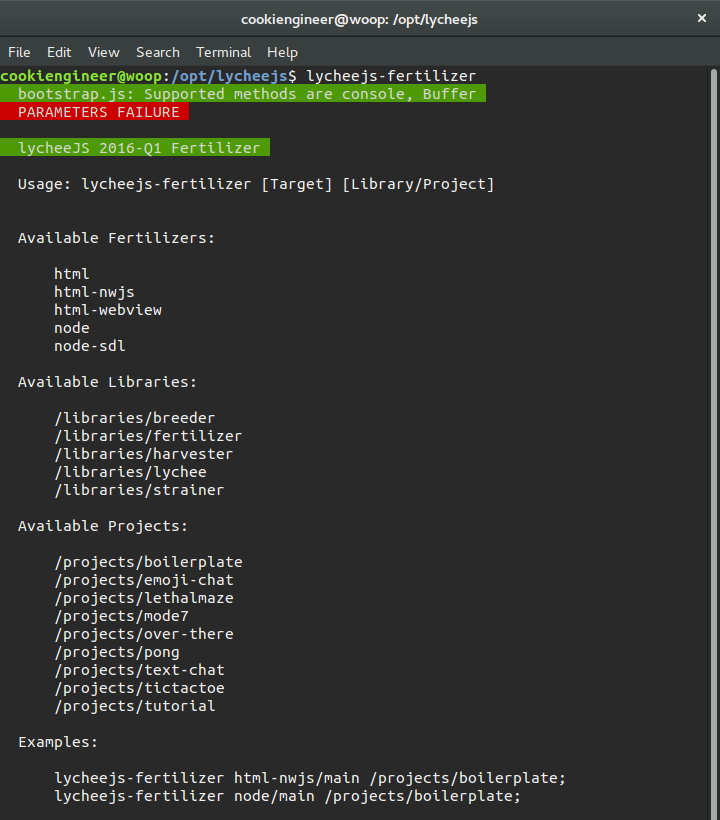
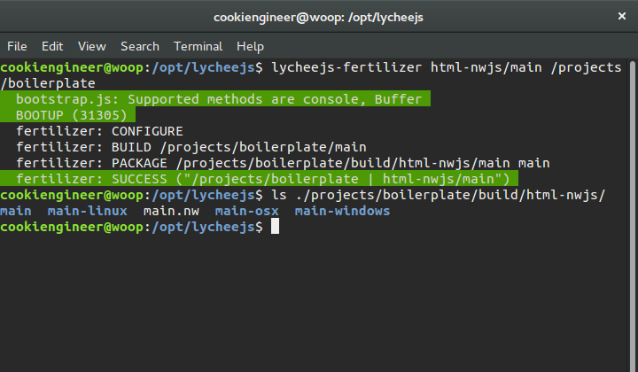
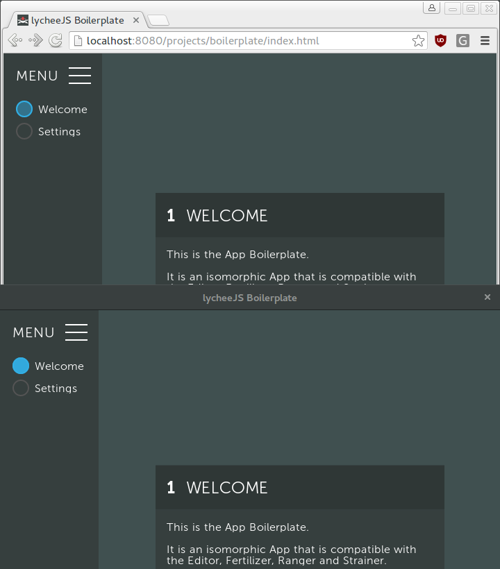

# Fertilize an App

This tutorial will explain you how to get an existing project
into a native App whilst using the `lycheejs-fertilizer`.

The focus is on the command-line tool here, because the Editor
automatically builds those fertilized Apps for you behind the
scenes and it uses the identical toolchain.


## Prerequisites

You should have successfully installed lycheeJS already.
If you haven't installed lycheeJS on your development machine,
you can follow the instructions at the [Bundles](#!bundles)
section on the left.


## Build Targets inside lychee.pkg

The isomorphic Boilerplate is already fully integrated with
the lycheeJS stack. It has a `lychee.pkg` that has a fully
setup `/build` section for all isomorphic platforms.

The `/build/environments` section in the JSON file has
several sections looking similar to this:

```javascript
{
  "build": {
    "environments": {
      "html-nwjs/main": {
        "build": "app.Main",
        "debug": false,
        "packages": [
          [
            "app",
            "./lychee.pkg"
          ]
        ],
        "sandbox": false,
        "tags": {
          "platform": [
            "html-nwjs",
            "html"
          ]
        },
        "variant": "application",
        "profile": {
          "client": "/api/Server?identifier=/projects/boilerplate"
        }
      }
    }
  }
}
```

These JSON structures are the so-called build targets. Their
identifier must fulfill of the `platform/target` scheme.

All `lychee.Environment` instances are completely serializable,
which means they can be snapshotted and reproduced 1:1 on any
other lycheeJS-supported platform.


## The lychee.Environment Serialization Concept

For example, if you can pause an App on an Android tablet and
resume the App on your Desktop (native or Browser) App. Even
the UI events like touches, swipes and keyboard or gamepad
commands are serialized - so user-caused errors in your App
logic are also reproducible and simulateable 1:1.

The important part here is that lycheeJS supports incremental
platforms (or fertilizers). For example, the `html-nwjs`
runtime inherits from `html`.

When the `/tags/platform` setting of a `lychee.Environment`
is set to an `Array of platforms` it will try to respect
supported platforms dynamically when they are supported.

All Definitions in the lycheeJS stack have a `supports()`
method that is called to determine the compatibility with
the (simulated or) currently executed platform runtime.


## Fertilize the Boilerplate

The Fertilizer is the tool that uses the build environments
inside the `lychee.pkg` file to cross-compile and cross-package
your Projects or Libraries.

```bash
cd /opt/lycheejs;

lycheejs-fertilizer;
```




If you want to fertilize an Application for a specific platform,
just use an environment setup of the `lychee.pkg/build/environments`
section.

```bash
lycheejs-fertilizer html-nwjs/main /projects/boilerplate;
```

If everything worked as expected, the output of the above commands
should look like this:



Now you have cross-compiled your first application. Wasn't that easy?

If you want to execute the final build, just navigate to the
`./projects/boilerplate/build/html-nwjs` folder and select the
build matching your OS.


As I'm using Linux, I can now open the `build/html-nwjs/main-linux/main.bin`
file. A direct comparison of the Boilerplate running in the Web Browser
and as a native App looks like this:



