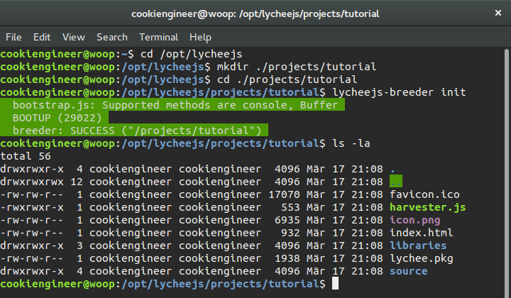
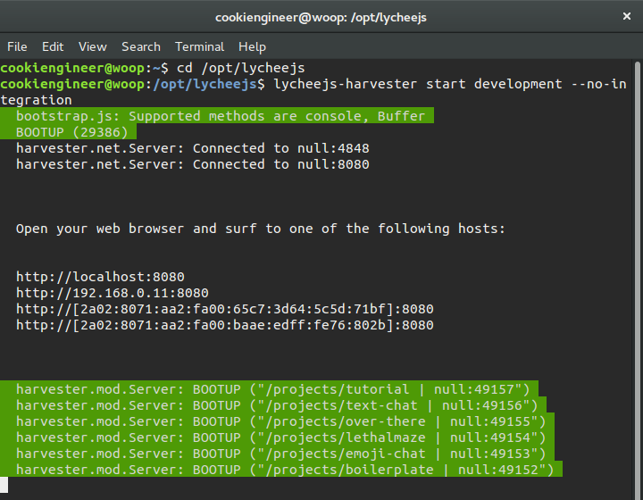
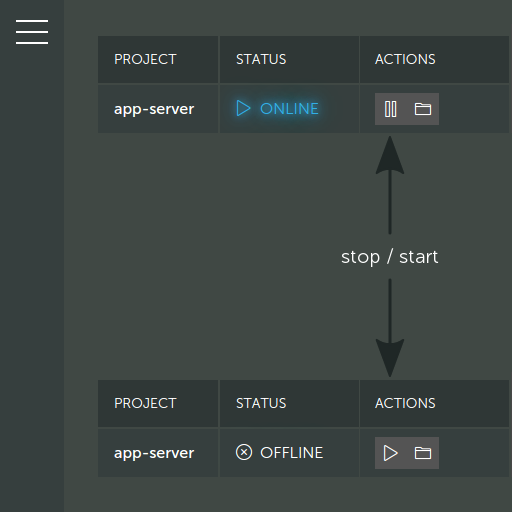

# Create an App Server

This tutorial will explain you how to create an App Server
that uses the `node` platform stack with the
`lychee.net.Server` that you can use server-side.


## Prerequisites

You should have successfully installed lychee.js already.
If you haven't installed lychee.js on your development machine,
you can follow the instructions at the [Bundles](#!bundles)
section on the left.


## Initialize the Project

The `/projects` folder inside the lychee.js directory contains
all projects made with lychee.js. It already contains many
examples and demos that you can open, edit and manipulate
with the lychee.js tools.

First of all, we need to create our new project using the
`lycheejs-breeder` command line tool. The Breeder is the
tool that helps you setup your application in a convenient
way, so that you don't waste much time copy/pasting all the
necessary Boilerplate code yourself.

It is explicitely important to create lychee.js projects
only in the `lycheejs/projects` subfolder in order to have
all features offered by the lychee.js stack.

As all tools are cross-dependent, the Breeder also interacts
with the Fertilizer, Strainer, Harvester, Editor, Ranger
and all the other tools behind the scenes automagically.

```bash
cd /opt/lycheejs;

# Create the project folder
mkdir ./projects/tutorial;
cd ./projects/tutorial;

# Initialize the isomorphic Boilerplate
lycheejs-breeder init;
```

If everything worked as expected, the output of the above commands
should look like this:




By default the Breeder automatically injects the `lychee`
library. As the lychee.js folder has the `/libraries` and
`/projects` folders as a convention, all projects have also
an (optional) `/libraries` folder.

The advantage hereby granted is that you can later deploy an
isolated project to other servers without having to have
lychee.js installed there.

```
/projects/tutorial
+-- /libraries
| +-- /lychee
|   +-- /build
|     +-- /node
|       +-- dist
|       | +-- index.js
|       +-- core.js
|
+-- /api
+-- /asset
+-- /build
+-- /source
| +-- /net
|   +-- Server.js
|   +-- /remote
|   | +-- Ping.js
|   +-- Client.js
|   +-- /client
|   | +-- Ping.js
| +-- /state
|   | +-- Menu.js
| +-- Main.js
| +-- Main.json
+-- index.html
+-- harvester.js
+-- lychee.pkg
```

The project structure is explained more in detail in the
[App Architecture Tutorial](#!tutorial/app-architecture).


## Bootup the Project

As you might have noticed, the project automatically has
a `harvester.js` file. It is named that way, because it
is the integration entry point for the `lycheejs-harvester`.

The Harvester automatically calls the `harvester.js` and
spawns the App Server on an ephermal port ( `49152` to `65534` )
dependent on what other programs already run on your machine
and use the ports already.

Now you have to start the `lycheejs-harvester` (if not done
already) with the `development` profile in a separate
Terminal window.

```bash
cd /opt/lycheejs;

# Run lychee.js Harvester
lycheejs-harvester start development;
```

All profiles of the Harvester are located in `/opt/lycheejs/bin/harvester`
and can be modified (once booted up) with the Ranger.

If you have problems when starting the `lycheejs-harvester` on a
specific port, you can modify the `port` property in the
`/opt/lycheejs/bin/harvester/development.json` file.

If everything worked as expected, the output of the above commands
should look like this and contain the following line:

```bash
harvester.mod.Server: BOOTUP ("/projects/tutorial | null:49157")
```



After you have done work, you can stop the Harvester in a separate
Terminal window with the `lycheejs-harvester stop` command or by
pressing the `CTRL` + `C` shortcut ( `CMD` + `C` on OSX).


## Modify the Project

The isomorphic Boilerplate has already an integrated `lychee.net.Server`,
which you can easily extend with our own `lychee.net.Service`.

Taking a glance at the `HEADER` section of the `source/net/Server.js`
file, you can see that the Server has requirements and includes that
the Definition inherits from.

```javascript
lychee.define('app.net.Server').requires([
	'lychee.data.BitON',
	'app.net.remote.Ping'
]).includes([
	'lychee.net.Server'
]) // ...
```

The Definition of the `app.net.Server` for now requires two other
definitions. The `lychee.data.BitON` codec which is required for
encoding and decoding all data across the network; and the
`app.net.remote.Ping` service which is our initial dummy service
for measuring latencies in our network.

Each Definition has an `exports()` call with the so-called Definition
Body. This body contains and returns the actual Implementation of
your Definition.

The lychee.js Codestyle and how the Definition Layout looks like is
explained more in detail in the [CODESTYLE](https://github.com/Artificial-Engineering/lychee.js/blob/master/guides/CODESTYLE.md#definition-layout)
Guide.


## Extend the Project

Taking a more detailed look at the `source/net/Server.js`, you can see
that the `app.net.Server` has a `connect event` wherein all connected
remotes are passed through.

The `lychee.net.Remote` has the identical interface as the
`lychee.net.Client` because they both inherit from `lychee.net.Tunnel`.
The idea behind a centralized `lychee.net.Tunnel` interface is that
all connected peers (no matter if server-side or client-side) have
the identical APIs and can be switched in their role anytime.

The `lychee.net.Tunnel` has an `addService()` method that accepts a
`lychee.net.Service` instance. In our case it currently gets added
only the `app.net.Ping` service, but you are going to extend the
server with another Chat service.


## Create a new Service

You need to create a new service. For now (as it's easier to understand)
you simply create a service that inherits from the `lychee.net.remote.Chat`
interface.

Create the `source/net/remote/Chat.js` file with the following content:

```javascript
lychee.define('app.net.remote.Chat').includes([
	'lychee.net.remote.Chat'
]).exports(function(lychee, app, global, attachments) {

	/*
	 * IMPLEMENTATION
	 */

	var Class = function(remote) {

		lychee.net.remote.Chat.call(this, 'chat', remote, {
			limit: 1337 // 1337 users allowed to join
		});

	};


	Class.prototype = {
		
	};


	return Class;

});
```

After you've created the new service with the identifier `chat`, you need
to integrate it with the `app.net.Server`. Add it to the requirements in
the `source/net/Server.js` file.

I'll leave that up to you as it was explained in the Definition Header
section of this tutorial. Don't forget to add the service onto the `remote`
inside the `connect event` of the server afterwards!


## Manage the Project

As you changed the server's implementation, you now have to restart it.
Therefore you can either restart the `lycheejs-harvester` completely
(which would be a shame resource-wise) or you can use the lychee.js Ranger
for that purpose.

You can now execute `lycheejs-ranger` in a Terminal window and the native
Ranger App will start.



In the Ranger, you can stop the server by clicking on the `stop` icon
next to the `tutorial` project. Afterwards, you can start the server
again by clicking on the same button that now has the `start` icon.

